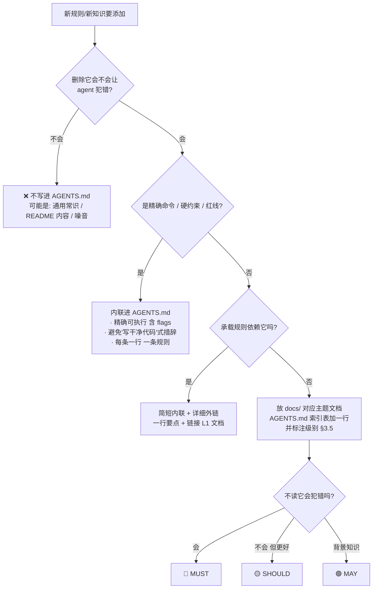

# AGENTS.md 设计指南（调研成果）

> 本仓库 AGENTS.md 的维护规范。**新增任何规则前，先读本文档**——它回答了"这条规则该不该进 AGENTS.md、放哪里、怎么写"。
>
> 本文档基于 2026 年 8 月的公开研究（论文 + 大厂工程文章）沉淀，来源见文末 [证据来源](#证据来源)。结论部分可复用，具体引用请回溯原文。

---

## 1. 一句话结论

**AGENTS.md 是指针地图，不是知识百科全书。** 它只回答"agent 在开始任何任务前必须知道什么"：项目是什么、精确命令、非显而易见的约束、去哪找详细文档。知识本体放在 `docs/`，按需加载（progressive disclosure）。

## 2. 为什么必须保持精简（证据）

| 证据 | 发现 | 来源 |
|------|------|------|
| **Lost in the Middle**（TACL 2024） | LLM 对上下文**开头/结尾**的信息利用最好，**中间显著退化**（U 形曲线）。指令文件越长，关键规则越容易埋在中间被忽略 | Liu et al., arXiv:2307.03172 |
| **Found in the Middle**（2024） | 位置注意力偏置是结构性现象：模型对开头/结尾 token 给予不成比例的注意，与相关性无关 | Hsieh et al., arXiv:2406.16008 |
| **ETH Zurich 评估**（2026） | 过长的 AGENTS.md 使推理成本平均增加 **20%+**（agent 跟随指令进行超出必要的探索）；LLM 生成的冗长内容在 5/8 场景降低任务成功率 | arXiv:2602.11988 |
| **2500+ 仓库分析**（GitHub/Atlan） | 超过 ~150 行后收益递减，推理成本增加 **20–23%** 而无质量收益；「命令」是最高 ROI 部分 | github.blog, 2025-11 |
| **Anthropic 官方** | 目标 **<200 行/文件**；"过度指定的 CLAUDE.md 会让 Claude 忽略一半规则"；每个会话加载固定成本 | code.claude.com/docs |

**推论**：AGENTS.md 每一行都在消耗上下文预算、稀释关键规则权重。黄金测试见 §4。

## 3. 内容分层模型

```
┌─────────────────────────────────────────────────────┐
│ L0  AGENTS.md（根）          ~60-200 行，每会话加载     │
│     · 一句话项目简介                                   │
│     · 精确命令（构建/测试/验证，含 flags）              │
│     · 非显而易见的硬约束（边界、红线、gotchas）        │
│     · 文档索引表（用途 + use when）                    │
├─────────────────────────────────────────────────────┤
│ L1  docs/*.md（按主题）      按需阅读（agent 主动查阅）  │
│     · 架构、API 参考、发版、验证、UI 约定…             │
├─────────────────────────────────────────────────────┤
│ L2  研究/归档（docs/research, docs/archive）           │
│     · 历史调研、设计决策、调查记录（通常不主动读）     │
└─────────────────────────────────────────────────────┘
```

- **L0 引用 L1**：`docs/architecture.md` 而非内联；`docs/release-workflow.md` 而非手抄发版步骤。
- **L0 到 L1 的引用是"提示存在"，不是"已加载"**：链接文档不会自动进上下文。**承重规则（load-bearing）必须内联**在 AGENTS.md，或使用支持 `@import` 机制的显式导入；只说"见 docs/xxx"而规则本身依赖该文档 = 规则经常被遗忘。
- 经验行数：Sentry 目标 **<60 行**，Atlan 建议 **<150 行**，Anthropic 上限 **200 行**，超过 ~400 行 agent 开始跳过。

## 3.5 引用级别（MUST / SHOULD / MAY）——索引表必须标注

AGENTS.md 的**文档索引表**不能只有"用途 + use when"，还必须有**级别列**——否则 agent 无法区分"不读会出错"和"读了更好"。

### 级别定义（源自 RFC 2119 / BCP 14，业界标准）

| 级别 | 大写关键字 | 含义 | 本仓库示例 |
|------|-----------|------|-----------|
| 🔴 必读 | **MUST** | 绝对要求。该场景下**必须先读再行动**，跳过会导致错误、违规或返工 | `docs/release-workflow.md`（发版前）、`docs/verification-requirements.md`（声称完成前）、`docs/chatscreen-editing-protocol.md`（编辑 ChatScreen.kt 前） |
| 🟡 建议 | **SHOULD** | 推荐。有正当理由可跳过，但需理解后果后再决定 | `docs/opencode-api-reference.md`（开发前）、`docs/architecture.md`（跨层修改时） |
| 🟢 可选 | **MAY** | 真正可选。了解即可，不读不影响正确性 | `docs/architecture-debt.md`（了解限制） |

**判定问题**：这条文档不读，agent 会不会犯错/违规？
- 会 → **MUST**
- 不会但质量会提高 → **SHOULD**
- 只是背景知识 → **MAY**

### 使用纪律（RFC 2119 §6 + 社区共识）

- **MUST 必须稀缺**：RFC 2119 明确"must be used with care and sparingly"——只在"不读会出错/会违规"时用。社区分析（BuildThisNow）：当所有规则都标 ALWAYS/NEVER/CRITICAL 时，**没有一条会被遵守**；硬约束（MUST/硬红线）保持在 **5–7 条**以内。
- **大小写即语义**（RFC 8174）：只有大写 MUST/SHOULD/MAY 表示规范级别。中文用 🔴 必读 / 🟡 建议 / 🟢 可选 显式标注，避免歧义。
- **级别随场景变**：同一文档在不同场景下级别不同（如 release-workflow 在"发版"场景是 MUST，在日常开发是 MAY）——索引表的 use when 列描述的就是 MUST 生效的场景。
- **定期复审**：级别定高了（SHOULD 变 MUST）和定低了（MUST 变 SHOULD）都要在维护时修正。

## 4. 新增规则决策流程（每次改 AGENTS.md 必走）



**配套提问**（Anthropic 官方）：
1. 这条是 agent 看代码/文件系统**自己就能推断**出来的吗？→ 是则排除
2. 这是 agent 训练时**已知的标准约定**吗？→ 是则排除（如"写干净代码"）
3. 这是**通用软件工程原则**吗？→ 是则排除（各来源一致强调）
4. 这是**详细 API 文档/长教程**吗？→ 是则外链
5. 这是**变化频繁的信息**吗？→ 是则排除或放 L1

## 5. 写作规范（怎么写才被遵守）

| ✅ 做 | ❌ 不做 |
|-------|--------|
| 精确命令：`.\gradlew :app:assembleDevDebug`（含 flags、JDK、超时） | 只说工具名：`运行 gradle` |
| 具体到可验证：`API handlers live in src/api/handlers/` | 模糊：`keep files organized` |
| 三层边界：**Always do / Ask first / Never do** | 只写偏好："prefer clean code" |
| 代码示例 > 三段解释 | 散文描述代码风格 |
| 一条规则一个 bullet | 长段落、欢迎语、结论语 |
| 命令放靠前位置（最高 ROI） | 把详细架构写进根文件 |
| 维护：规则过时同步更新（同 commit） | 复制 README/CONTRIBUTING 内容 |

- **一致性**：两条规则互相矛盾时，模型可能任意选一条。定期审查消除过期/冲突规则。
- **强调机制**：`IMPORTANT` / `YOU MUST` 可用于提高遵adherence，但若多条都需要强调 = 文件太长、规则互相竞争，应删除而非加粗。
- **陈旧指令比缺失指令更糟**：命令一旦不真实（如改包管理器后没更新），agent 学会忽略整个文件。

## 6. 边界与安全

- AGENTS.md 是**上下文，不是强制策略**（Anthropic 明确：作为 user message 注入，非 system prompt）。要硬性阻止某操作，用 hook/权限层，不要指望指令。
- 提交 secrets 相关内容：只写**环境变量名**，不写值。
- 破坏性/生产/发版/凭据操作：写明"需人工批准"。
- 文件入 git 共享；个人偏好放个人级文件（如 `~/.claude/CLAUDE.md`、`AGENTS.local.md`）。

## 7. 反模式清单（本仓库曾犯/易犯）

| 反模式 | 正确做法 |
|--------|---------|
| 把详细架构树（30+ 行目录说明）写进根文件 | 移入 `docs/architecture.md`，根文件留 3 行概览 + 链接 |
| 手抄发版步骤（bump/commit/tag/Release 全流程） | 一行 `见 docs/release-workflow.md` + 一条红线 |
| 把设计历史/调研过程写进根文件 | 归档到 `docs/research/`、`docs/archive/` |
| 用"重要!"强调每一条规则 | 删掉非承重规则，只留真正会犯错的 |
| 引用文档却不给出"何时读它" | 索引表每行写用途 + use when |
| 规则与代码不同步（如已改 Ktor 引擎还写旧引擎） | 修改代码的同一 commit 更新规则 |

## 8. 证据来源

**论文**
- Liu et al., *Lost in the Middle: How Language Models Use Long Contexts*, TACL 2024 / arXiv:2307.03172
- Hsieh et al., *Found in the Middle: Calibrating Positional Attention Bias…*, arXiv:2406.16008
- *An ETH Zurich evaluation of AGENTS.md*（上下文文件增加推理成本），arXiv:2602.11988

**标准**
- RFC 2119 / BCP 14, *Key words for use in RFCs to Indicate Requirement Levels*（MUST/SHOULD/MAY 需求级别定义）
- RFC 8174, *Ambiguity of Uppercase vs Lowercase in RFC 2119 Key Words*（仅大写表示规范级别）

**官方与大厂**
- Anthropic: *Best practices for Claude Code*（含 Include/Exclude 表、<200 行、黄金测试）— code.claude.com/docs/en/best-practices
- Anthropic: *The new rules of context engineering*（移除 80% system prompt；"文件树在正确时机加载"）— claude.com/blog
- Anthropic: *How Claude Code works in large codebases*（"root file should be pointers and critical gotchas only"）— claude.com/blog
- OpenAI: *Custom instructions with AGENTS.md*（Codex，32 KiB 上限）— developers.openai.com/codex
- GitHub: Matt Nigh, *How to write a great agents.md: Lessons from over 2500 repositories* — github.blog
- agents.md 官方约定（Agentic AI Foundation / Linux Foundation）— agents.md
- Sentry skills: `agents-md`（目标 <60 行，绝不超 100）— github.com/getsentry/skills

**社区深度指南**
- *AGENTS.md as table of contents* 模式 — agentpatterns.ai
- *How to write an effective AGENTS.md* — agent-ready.dev（"index, not the encyclopedia"）
- *AGENTS.md Complete Guide*（渐进式披露，>400 行 agent 开始跳过）— terminalblog.com
- *How to Write an AGENTS.md File: The Complete Guide*（<150 行、20-23% 成本数据）— atlan.com
- *AGENTS.md and context management*（<2K tokens 理想）— self.md
- *AGENTS.md vs CLAUDE.md Explained*（6 级优先级层级、硬约束 5-7 条上限）— buildthisnow.com

---

*维护：本文档随调研/实践演进更新；更新时同步本仓库 AGENTS.md 的引用。*
